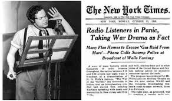

<!-- *cool cite*. -->

The Golden Age of Radio in the United States signed a revolution of media access in the country.

To study the effect of radio on American society during the interwar period I coded in R a model of ground wave propagation that, given the characteristics of the transmitting antenna and the distance of the receiver outputs the signal strength of the ground wave.
The model takes into accounts ground conductivity that is the most important factor that affects the attenuation of the ground wave.
<!--
Below the coverage of NBC in 1940 in the US at day time.

 -->

The technical details of AM radio propagation and the way I implemented the model are available [here](https://gianlucarusso.github.io/gianlucarusso_radio_appendix.pdf). I am turning the code I wrote into an R package that will be available for download on Github soon.
