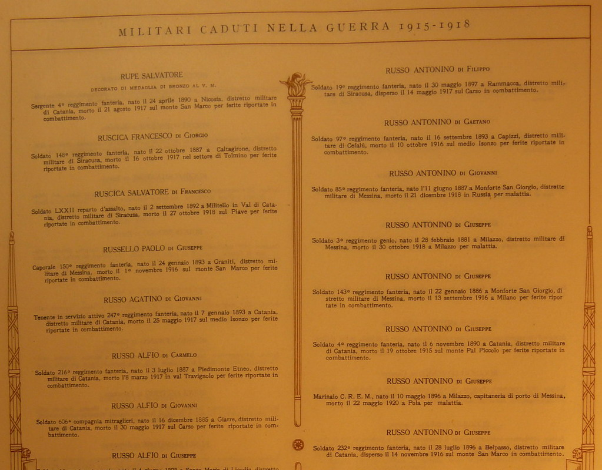

<!-- After WWI The Italian Ministry of War allocated substantial financial resources to gather, organize and analyze large amount of data on the conflict. The Ministry hired the most prominent scholars and utilized Powers and Hollerit accounting machines to process the data for the first time in history. Although with some discrepancies, Giorgio Mortara and Corrado Gini worked up to conclude that approximately 650,000 Italian soldiers died during or immediately after the conflict. -->

As part of the state propaganda, the Fascist regime organized a massive data collection on the identity of all the military personnel who died during WWI. The goal of the propaganda was to manufacture a narrative that would legitimate and place the birth of Fascism among the battlefields of the war. To do so, the Ministry allocated substantial resources to the task. It hired the most prominent statisticians and utilized Powers and Hollerit accounting machines to process data for the first time in Italian history. Although with some discrepancies, Giorgio Mortara and Corrado Gini worked up to conclude that approximately 650,000 Italian soldiers died during or immediately after the conflict.[^1]

[^1]: Historical Demographer [Alessio Fornasin](http://fornasin.weebly.com) has written a lot about the different estimates of WWI Italian fatalities.

The sources used to piece the records together were multiple. These encompassed data from the various statistical offices of the army and the Ministry of War, records from Italian municipalities and data from the Italian and Austrian Red Cross. The Ministry started the publication of the first roll of honor in 1926. Comprising 28 volumes, the publication was concluded only in 1964. Each volume lists the fatalities by Italian macro regions. Among the information included are the municipality and data of birth, rank and unit at time of death, cause and place of death. The historical municipality of birth refers to the name of the municipality as it appeared on the drafting cards, hence approximately the end of the nineteenth century.

One can search individual records on different websites. However, the most comprehensive one is probably [cadutigrandeguerra.it](http://www.cadutigrandeguerra.it/CercaNome.aspx). It is curated by [Istoreco](https://www.istoreco.re.it): the Institute for the history of the Resistance.

